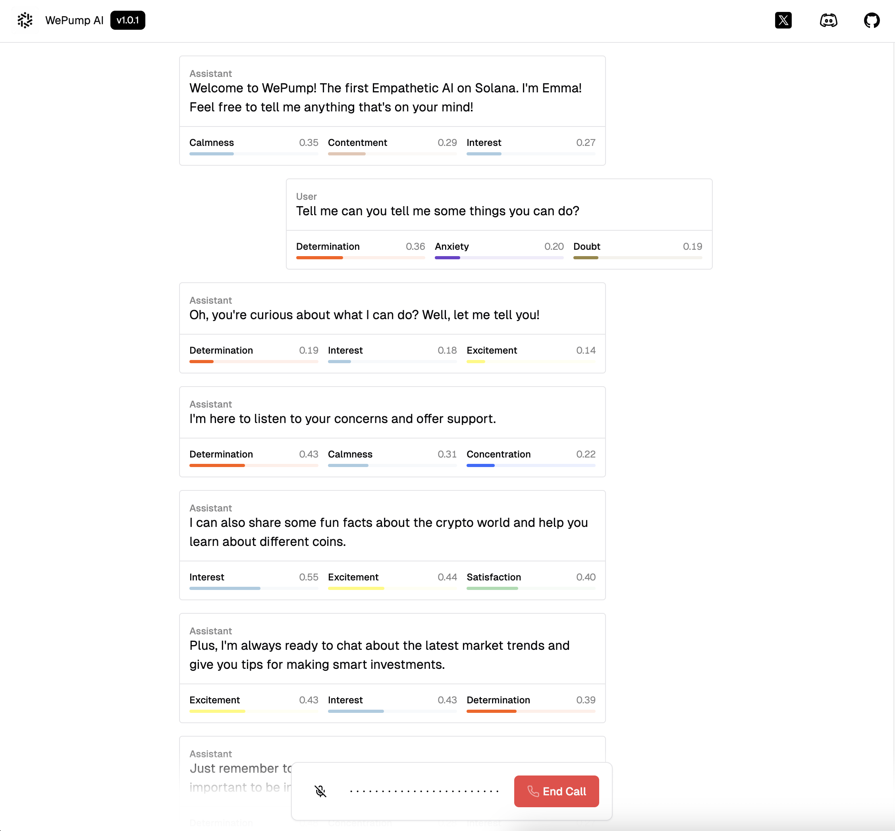

<!-- PROJECT LOGO -->
 

  

<h3 align="center">WePump AI</h3>

  

    First Empathetic AI on Solana
     
    Find your yin & yang.
     
    <a href="https://docs.wepumpai.help"><strong>See the WePump AI Docs »</strong></a>
     
     
    <a href="https://wepumpai.help">Website</a>
    ·
    <a href="https://x.com/wepumpinc">Twitter</a>
    ·
    <a href="https://discord.gg/C66PqXT2">Discord</a>
  

<!-- The Project -->
## WePump AI's Emma

WePump AI release 1.0.1

### Built With
 

 

</img>

### WePump SDK API
Coming soon!